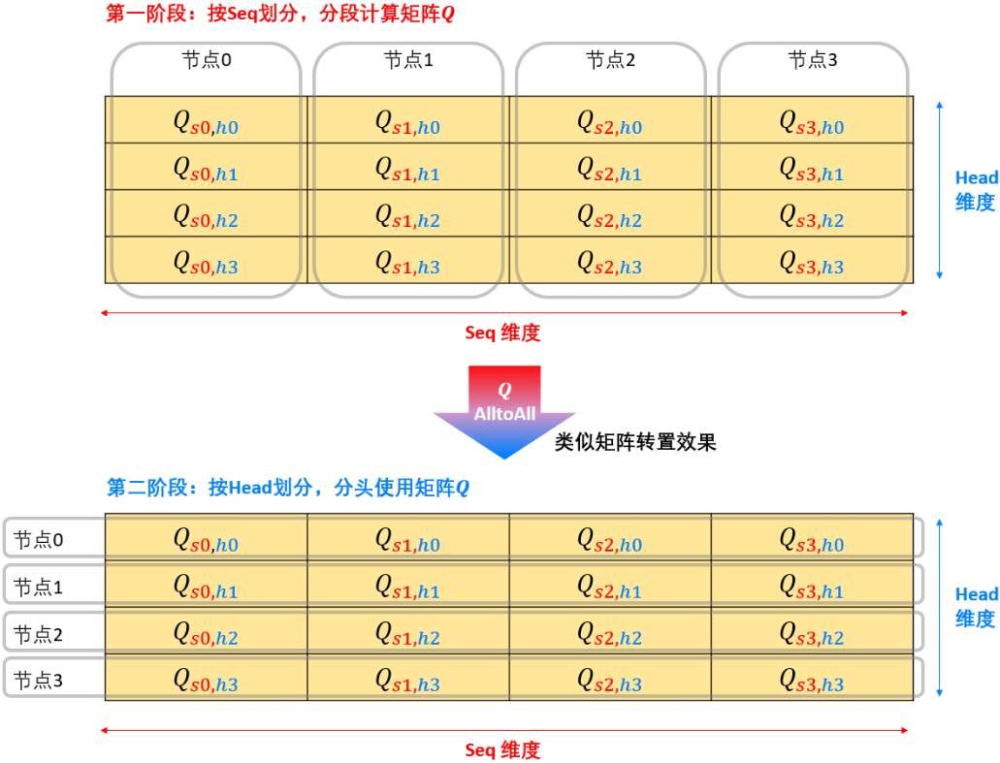

# 基础通信操作

| 类型  | 名称            | 行为                      |
| --- | ------------- | ----------------------- |
| 一对一 | Send          |                         |
| 一对一 | Receive       |                         |
| 一对多 | Broadcast     | 一个节点数据广播至多个节点           |
| 一对多 | Scatter       | 一个节点数据切片分发至多个节点         |
| 多对一 | Gather        | 多个节点数据收集到一个节点上          |
| 多对一 | Reduce        | 多个节点数据收集到一个节点并进一步处理（规约） |
| 多对多 | ReduceScatter | 多个节点数据切片送至对应节点并规约       |
| 多对多 | AllGather     | 每个节点数据发送到所有节点           |
| 多对多 | AllReduce     | 每个节点数据发送到所有节点并规约        |
| 多对多 | AlltoAll      | 每个节点Scatter和Gather等量数据  |
| 多对多 | AlltoAllV     | 每个节点Scatter和Gather不等量数据 |
除了AlltoAll和AlltoAllV，多对多的发送和接收行为都可以通过名称中两个单词各自行为组合理解。
# 分布式训练并行策略
## 1. 数据并行（Data Parallelism, DP）
将batch数据切分。
集合通信操作：

| 通信操作      | 通信数据 | 发生时间        | 通信次数  | 每次通信数据量     |
| --------- | ---- | ----------- | ----- | ----------- |
| Broadcast | 模型参数 | 初始化后        | 1     | 模型参数量       |
| AllReduce | 梯度   | 每批次数据计算出梯度后 | epoch | 并行节点数x模型参数量 |
- 优势
	- 处理大型数据集
	- 调整节点灵活配置batch大小

- 限制
	- batch不能太大，并行规模有上限；且batch划分太小增加通信成本

## 2. 模型并行
### 2.1 流水并行PP
模型按层拆分。
- 核心
	- 互相依赖，并行受限，如何提高吞吐率
	- 像流水一样每个节点顺序计算一个batch中的小批量数据
	
	增加更多小批次可以减小bubble，提高数据利用率。但同时会增加数据存活时间，增加存储需求。
#### 2.1.1 分组流水并行

交错进行前向和反向传播，可以保证稳定期节点利用率100%，同时降低存储需求。

#### 2.1.2 交替流水并行

同一时间一半正向一半反向传播，缩短上升下降期，但可能由于正向反向时间差异导致部分节点存在数据同步的时间空挡。

| 通信操作        | 通信数据 | 发生时间       | 通信次数                          | 每次通信数据量  |
| ----------- | ---- | ---------- | ----------------------------- | -------- |
| Send/Receve | 激活值  | 前向传播每个阶段结束 | epoch\*(传播次数\*(流水阶段数-1)*小批量数) | 阶段边界激活值数 |
|             | 梯度   | 反向传播每个阶段结束 |                               | 阶段边界梯度数  |

### 2.2 张量并行（Tensor Parallelism, TP）
每一层切割

反向传播过程：

数据流动方式：

|      | 列并行                                  | 行并行                                  |
| ---- | ------------------------------------ | ------------------------------------ |
| 前向传播 | X：拷贝至各节点，Broadcast Y：拼接各节点，Gather | X：切片分发至各节点，Scatter Y：求和各节点：Reduce |
| 反向传播 | Y：切片分发至各节点，Scatter X：求和各节点，Reduce | Y：拷贝至各节点，Broadcast X：拼接各节点，Gather |
实际使用中往往跨层部署，级联使用，下面具体分析：
#### 2.2.1 列+列
拼接（Gather）+拷贝（Broadcast）= AllGather

#### 2.2.2 行+行
求和（Reduce）+切片（Scatter）=ReduceScatter，先切片，再分发至各节点求和

#### 2.2.3 行+列
求和（Reduce）+拷贝（Broadcast）=AllReduce，每个节点数据分发到其它节点并求和

#### 2.2.4 列+行
拼接（Gather）+切片（Scatter）=相互低效，无需通信

由于其优越的通信表现，列+行并行是张量并行中的常见用法。如连续两个全连接层级联就可以用列+行并行。

张量并行中间通信操作总结：

| 操作            | 通信数据   | 发生时间 | 通信数次数                        | 通信数据量   |
| ------------- | ------ | ---- | ---------------------------- | ------- |
| AllGather     | 激活值和梯度 | 级联中间 | epoch\*(前向和反向传播次数\*(级联层数-1)) | 集离或梯度数量 |
| ReduceScatter |        |      |                              |         |
| AllReduce     |        |      |                              |         |

### 2.3 专家并行 (Expert Parallelism, EP)
在分布式学习中针对MoE场景的并行策略，每个节点一个专家。由路由动态选择分发，涉及所有节点数据重分配，属于All2All操作。
核心问题：如何负载不均衡（有可能专家收到数据过多或过少）。
通信操作：

| 操作               | 通信数据   | 发生时间            | 通信数次数                        | 通信数据量          |
| ---------------- | ------ | --------------- | ---------------------------- | -------------- |
| All2All/All2AllV | 激活值和梯度 | 每个MoE模块前向/反向传播时 | epoch\*(2\*前向和反向传播次数*MoE模块数) | MoE输入输出激活值和梯度量 |

## 3. 序列并行/上下文并行/混合序列并行(Sequence Parallelism, SP)
数据并行在Transformer大语言模型下的扩展。
Transformer语言模型处理对象：
- batch，含有多个Sequence
- Sequence，含有多个token
- token，向量表示
序列并行即将序列切分到不同节点并行处理。可以摆脱单卡限制训练超长上下文大模型。
可以部署于两个阶段：
- Attention阶段，称为上下文并行（Context Parallelism, CP，来自Colossal-AI, Megatron-LM）；另有DeepSpeed提出混合序列并行Ulysess。目的打破输入序列长度限制；
- LayerNorm与Dropout阶段，来自Megatron-LM。目的与TP搭配减少存储压力。
### 3.1 Attention阶段序列并行

首先将W权重复制到各卡上（Broadcast)

- 计算1-3中，输入矩阵I被切分到各节点（实际加载时就处于各节点上，无需通信）
- 计算4中，每个节点的K需要收集各节点结果（AllGather），Q直接使用各自节点结果
- 计算5中，每个节点的V需要收集各节点结果（AllGather），A直接使用各自节点结果
最后所有节点梯度同步（AllReduce）
进阶：对于时间序列依赖的Attention（Causal Attention），不是所有KV都要用到，会导致通信不均衡，一般做token互补分组，详见论文Striped Attention: Faster Ring Attention for Causal Transformers
AllGather在反向传播时对应ReduceScatter，可以参考列行并行原理。

扩展：
1. Attention也可以将Head分到不同节点，即TP。不考虑复制权重，主要通信为正向Head输出AllReduce和反向一次的AllReduce；对比SP，正向各矩阵的AllGather和反向的ReduceScatter，此外SP不涉及Head之间通信，Multi-Head和Single-Head下行为一致
2. Ring Self-Attention（Colossal-AL提出）是Attention阶段SP的常见实现方式，将AllGather的通信步骤拆成多个Send和Receive。如下图所示，将K/V的Gather分步传输的同时，同步计算A/O分块，当计算A/O的时间大于传输时间，就可以避免AllGather的通信开销。 
3. Megatron-LM进一步提出CP优化Ring Attention（Context Parallelism for Scalable Million-Token Inference），原始的Ring Attention需要分为两步，所有节点的K传输完成后才能计算A的softmax，然后再AllGather一次计算O。而CP核心思想是结合Flash Attention的分块注意力计算，各自计算完KV再AllGather，最后再统一计算O，极大降低了通信开销。
4. Deepspeed提出的Ulysses方案，计算QKV和之前相同相同按长度切分，但在后面会对Head按节点切分，QKV各进行一次All2All操作，计算结果再进行一次All2All通信。

### 3.2 LayerNorm与Dropout序列并行
论文：Reducing Activation Recomputation in Large Transformer Models
目的：不增加通信量（一次AllReduce等价于一次ReduceScatter+AllGather），减少各节点对中间激活值的存储需求并降低LayerNorm和Dropout的计算量
原理：LayerNorm与Dropout与序列长度计算独立，Layer只与特征维度有关，不受SP影响，Dropout以元素为单位，不受SP、TP影响

纯TP以列+行并行为例，需要两次AllReduce；而SP+TP时，LayerNorm采用SP接入TP的列并行需要AllGather收集完整输入，然后行并行输出再ReduceScatter获得完整输出

## 4. zero并行/完全分片数据并行
ZeRO（Zero Redundancy Optimizer）由DeepSpeed提出，用于解决大模型训练时内存开销大的问题。
核心思想：去存储冗余，通信换存储，尽可能让不同节点不存重复数据，不做重复计算，需要时从其它节点通信获得。
完全分片数据并行Fully Sharded Data Parallel, FSDP就是ZeRO-3。

DP分布式训练基本流程：

1. 各节点收到完整参数及各批次训练数据，完成前向、反向传播，得到各自梯度；
2. AllReduce个节点梯度得到完整梯度；
3. 各节点使用完整梯度和完整OS更新完整模型

ZeRO-1将OS切分至各节点，内存需求降低4被，单卡通信提高1.5倍，流程如下：
1. 各节点收到完整参数及各批次训练数据，完成前向、反向传播，得到各自梯度（同基线）；
2. AllReduce个节点梯度得到完整梯度（同基线）；
3. 各节点使用完整梯度和部分OS更新部分模型参数；
4. AllGather收集各节点部分更新后参数完整更新参数。

ZeRO-2在1基础上继续切分梯度，内存需求降低8倍，单卡通信对比基线基本不变（相比ZeRO-1不需要通信完整梯度），流程如下：
1. 各节点收到完整参数及各批次训练数据，完成前向、反向传播，得到各自梯度（同基线）；
2. ReduceScatter整合各节点梯度得到部分梯度，把不属于自己节点的梯度丢弃；
3. 各节点使用部分梯度和部分OS更新部分模型参数；
4. AllGather收集各节点部分更新后参数完整更新参数。

ZeRO-3在2基础上切分参数，内存需求降低64倍，单卡通信提高1.5倍，流程如下：
1. 各节点收到部分参数及各批次训练数据
2. 前向传播，各节点AllGather收集完整参数，把不属于自己节点的梯度丢弃；
3. 反向传播，各节点AllGather收集完整参数，把不属于自己节点的梯度丢弃；
4. 反向传播完得到各自的梯度；
5. ReduceScatter整合各节点梯度得到部分梯度，把不属于自己节点的梯度丢弃；
6. 各节点使用部分梯度和部分OS更新部分参数（参数无需AllReduce）
