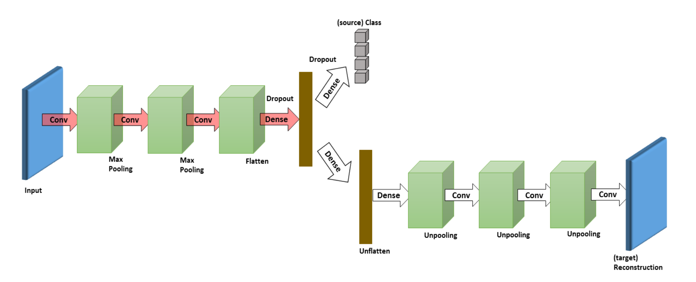

### 思想

需要模型能够提取到不同Domain的共同特征，从而改善对不同域的预测效果。本文人为需要从两个方面入手：

1. 模型可以将source domain的标签预测好；
2. 模型可以将target domain的输入数据正确重构；

### 模型

通道1用于预测标签，包含参数集合$\{\Theta_{enc}, \Theta_{lab}\}$;通道2用于重构输入数据（为无标签的target domain 数据准备），包含参数集合$\{\Theta_{enc}, \Theta_{dec}\}$

损失函数：
$$
\mathcal{L}_c^{n_s}(\{\Theta_{enc}, \Theta_{lab}\}):=\sum^{n_s}_{i=1}\mathscr{l}_c(f_c(\mathbf{x}_i^s;\{\Theta_{enc}, \Theta_{lab}\}),\mathbf{y}_i^s)
$$

$$
\mathcal{L}_c^{n_t}(\{\Theta_{enc}, \Theta_{dec}\}):=\sum^{n_t}_{i=1}\mathscr{l}_r(f_r(\mathbf{x}_j^t;\{\Theta_{enc}, \Theta_{dec}\}),\mathbf{x}_j^t)
$$

$l_c$使用交叉熵损失函数，$l_r$使用均方差损失函数。

模型训练好后可以直接用于预测target domain的数据。

### 实验

+ 统一使用一个数据集的训练集作为source domain，另一个数据集的测试集作为target domain

实验1：使用数个手写数据集来对比不同DA模型性能指标

实验2：使用AlexNet替换模型中的encoder和decoder再次实验，验证模型结构的有效性

### 总结

该论文最后通过理论验证说明加入原始域的图片重构训练模型对结果帮助不大

