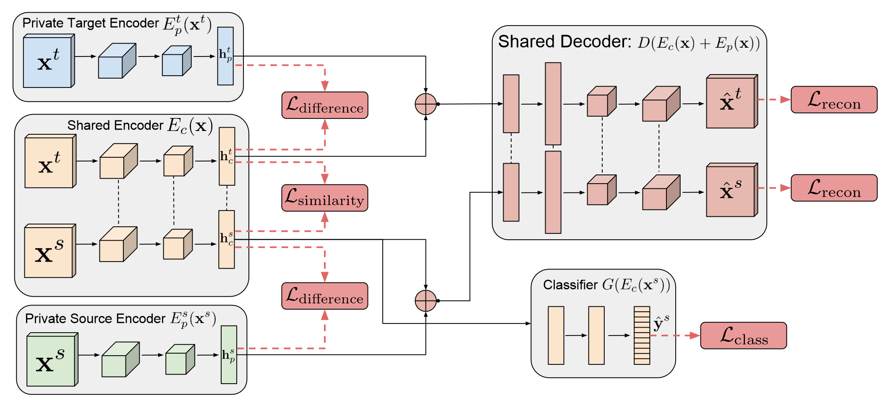

### 思想

前人在 unsupervised domain adaption领域的注意力多放在学习不同domain的不变特征上，并使用权重共享的编码器来实现。本文提出这会导致特征提取器引入和共享权重高度相关的噪音。所以本文将编码器分为domain间权重相似的编码器和每个domain独有的编码器。

### 模型

损失函数：
$$
\mathcal{L} = \mathcal{L_{task}} + \alpha\mathcal{L_{recon}} + \beta\mathcal{L_{difference}} + \gamma\mathcal{L_{similarity}}
$$
其中，$\mathcal{L_task}$用于优化模型预测结果 ，采用交叉熵损失函数：
$$
\mathcal{L_task} = -\sum^{N_s}_{i=0}\mathbf{y}^s_{i} \cdot \log\mathbf{\hat{y}}^s_i
$$
$\mathcal{L_{recon}}$表达重构损失函数，包含source domain 和 target domain两部分样本，每部分样本使用Scale-Invariant[^1] MSE损失函数：
$$
\mathcal{L}_{recon} = \frac{1}{k}\parallel \mathbf{x}-\hat{\mathbf{x}} \parallel^2_2 - \frac{1}{k}^2([\mathbf{x}-\hat{\mathbf{x}}] \cdot \mathbf{1}_k)^2
$$

$\mathcal{L_{difference}}$表达共享编码器和私有编码器之间的差异损失函数，这里的差异以向量角度表示，当两个向量互相垂直，则其点乘为0，该损失函数最小：
$$
\mathcal{L_{difference}} = \parallel\mathbf{H}^s_c\top\mathbf{H}^s_p\parallel^2_F + \parallel\mathbf{H}^t_c\top\mathbf{H}^t_p\parallel^2_F
$$
F范数为各元素平方之和。

另一边的相似度损失函数则是减弱某个分类器分辨source和domain的能力，使用二值交叉熵损失函数：
$$
\mathcal{L}_{similarity}^{DANN} = \sum_{i=0}^{N_s+N_t}\{d_i\log{\hat{d}_i} + (1 - d_i)\log{(1 - \hat{d}_i)}\}
$$
除了分类结果，为了保证两个公共特征提取的结果分布整体相近，本文还使用了MMD（Maximum Mean Discrepancy）损失函数：
$$
\mathcal{L}_{similarity}^{MMD} = \parallel \frac{1}{N^s}\sum_{i=0}^{N^s} \phi(\mathbf{ h_{ci}^s}) - \frac{1}{N^t}\sum_{j=0}^{N^t} \phi(\mathbf{h_{cj}^t}) \parallel^2_{\mathbf{H}}
$$
展开后：
$$
\mathcal{L}_{similarity}^{MMD} = \parallel \frac{1}{(N^s)^2}\sum_{i,j=0}^{N^s} \kappa(\mathbf{h_{ci}^s, h_{cj}^s}) - \frac{2}{N^sN^t}\sum_{i,j=0}^{N^s,N^t} \kappa(\mathbf{h_{ci}^s, h_{cj}^t}) + \frac{1}{(N^t)^2}\sum_{i,j=0}^{N^s} \kappa(\mathbf{h_{ci}^t, h_{cj}^t}) \parallel_{\mathbf{H}}
$$
这里通过映射函数$\kappa(x,y)$做差来对比两个空间分布的差异程度。文中的映射函数选择了多个高斯核函数的线性组合来保证其对高维特征的表达能力:
$$
\kappa(x_i, x_j) = \sum_n \eta_n\exp\{ -\frac{1}{2\sigma_n}\parallel \mathbf{x}_i - \mathbf{x}_j \parallel^2 \}
$$

### 想法

多层次模型：单目标预测、关键节点预测、完整轨迹预测

该文章的损失函数设计完备，是很好的学习案例

[^1]: [Eigen D., Puhrsch C. and Fergus R. Depth Map Prediction from a Single Image using a Multi-Scale Deep Network. NIPS 2014. ](https://papers.nips.cc/paper/2014/file/7bccfde7714a1ebadf06c5f4cea752c1-Paper.pdf)概

