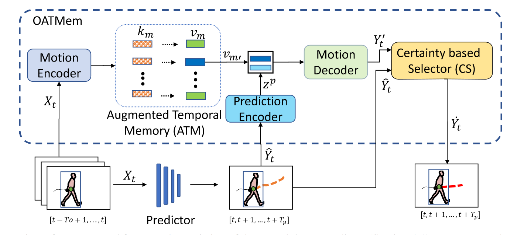
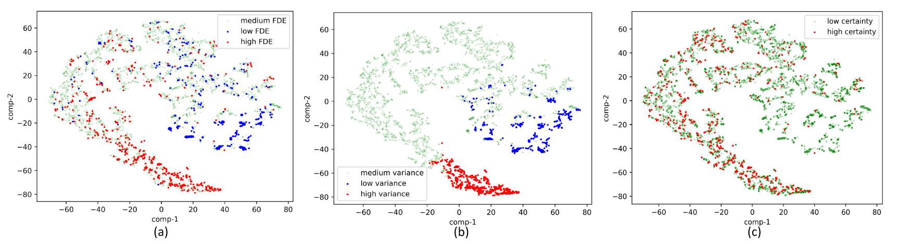
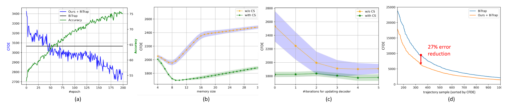
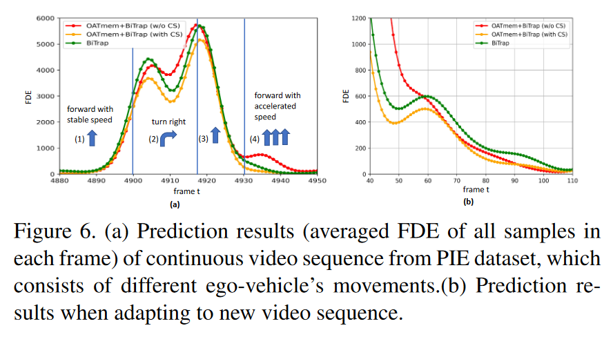

+ 测试时改善结果
+ 崭新的框架、训练范式和思路

### 轨迹预测的难点和必要性

难点：

动态场景变化，训练场景中的行人序列与测试场景存在较大差异

### 轨迹预测前人研究存在问题

+ 很多模型对很少出现的样本或者是没见过的样本预测效果很差
+ 一些针对这类问题的模型
  + 每个样本都需要更新网络
  + 需要知道模型细节
  + 假设测试集对网络可知，这在现实世界中不存在

### 思想

设计一种崭新的框架在测试中寻找与以前训练时相似的特征，以此改善原有预测器的输出结果

### 模型

+ predictor 是原始预测器
+ ATM是一种样本特征存储记忆
+ 不同于其它DA模型，该模型的Adapt（Motion Decoder）只发生在测试时
+ CS用于在改善结果和预测器原本结果中选取更好的结果，包含有一个GRU和一个MLP，需单独训练

相似度函数：
$$
s_m = \frac{e_tk_m}{\parallel e_t\parallel \parallel k_m \parallel}
$$
$e_tk_m$分别表示测试样本的特征和过去存储的样本特征。

### 实验

+ 消融实验中，可训练选择器对accuracy影响最大，但去掉后仍然比原始模型要好（说明其它结构的有效性）

#### 进一步分析

+ 使用motion variances 来划分轨迹类型（想法：进一步参考长尾效应那篇文章对其划分）

+ 参考[^1]使用t-SNE方法可视化高维特征，b图中高variance区域普遍**FDE更高**，并且从图中可以看到，选择器可以有效改善这类样本的结果（红色）

  + 

  + 

+ 更大的记忆样本数反而会降低预测精度，误导预测参考更久远的样本
+ 通过选择器对不同训练轮次的解码器（预测时使用最近的样本）都有较好的错误容量（tolerate the prediction errors）
+ 文章还对比了汽车不同动作下的模型预测情况：
  + 
+ **文章最后加了一个额外的实验来对比模型对new scenes的预测能力**
  + 选取一个新的场景，对比几个训练好的模型在新场景下的预测能力

### 想法

本文主要问题是对相关领域的研究不足，显得不专业，如特征数据存储相关研究很多，本文却涉猎不足。

+ 如何衡量提取特征的有效性？所有模型本质是特征表达+最后的解码器，关键在于高效的中间环节
+ FFT变换那篇文章效果好可能和无需训练就能表达转换为4维特征有关（可以包含更丰富的信息，本身也包含无需训练就能获得的有效先验知识）
  + 下篇论文研究各类先验高维特征表达方式？

[^1]: Laurens Van der Maaten and Geoffrey Hinton. Visualizing data using t-sne. Journal of machine learning research, 9(11), 2008.

