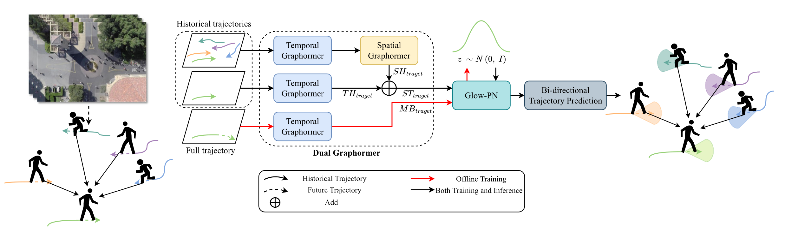
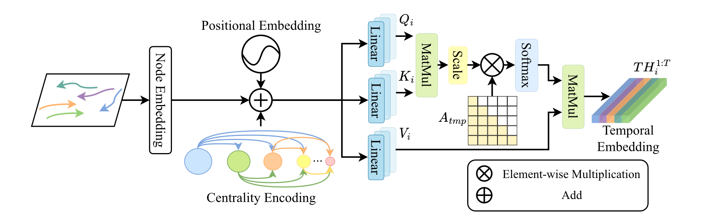
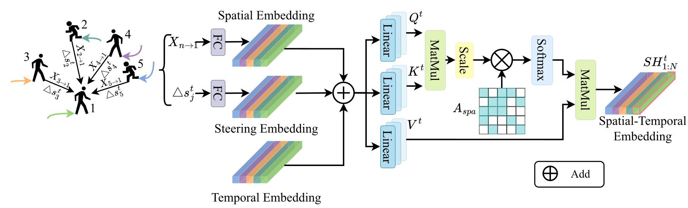
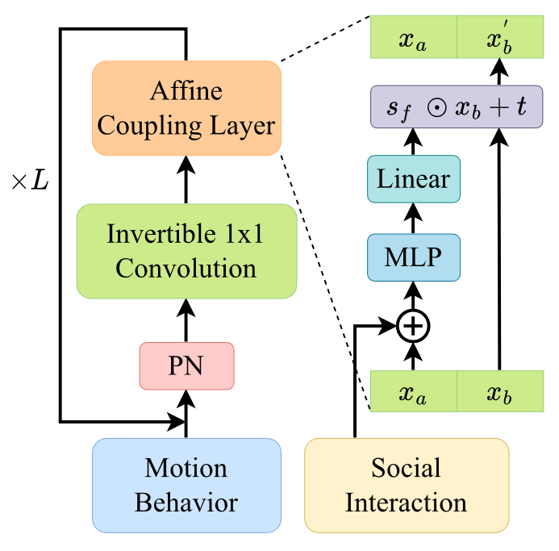
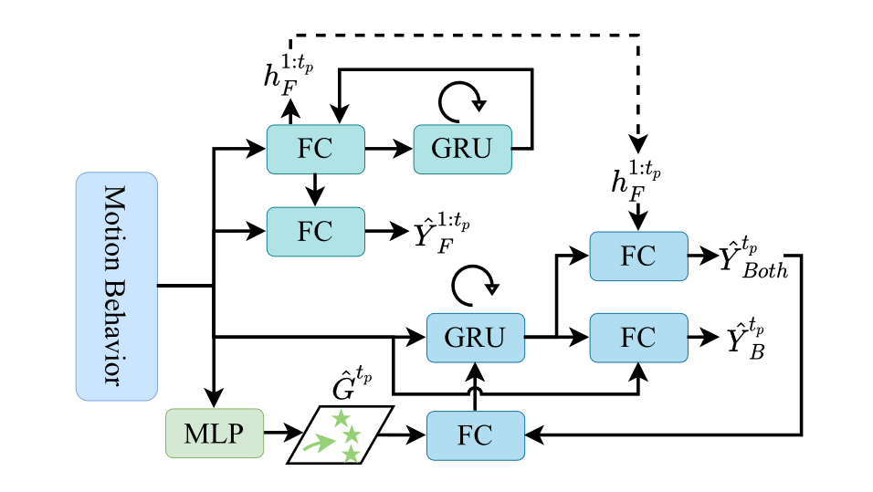
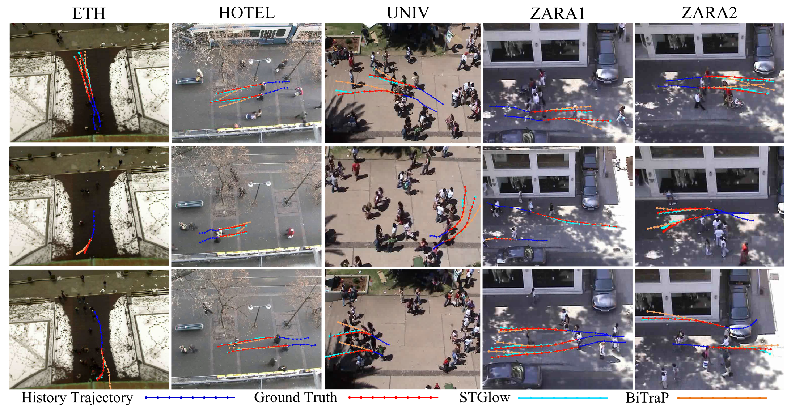
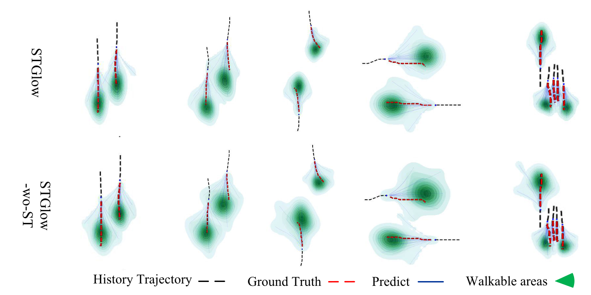
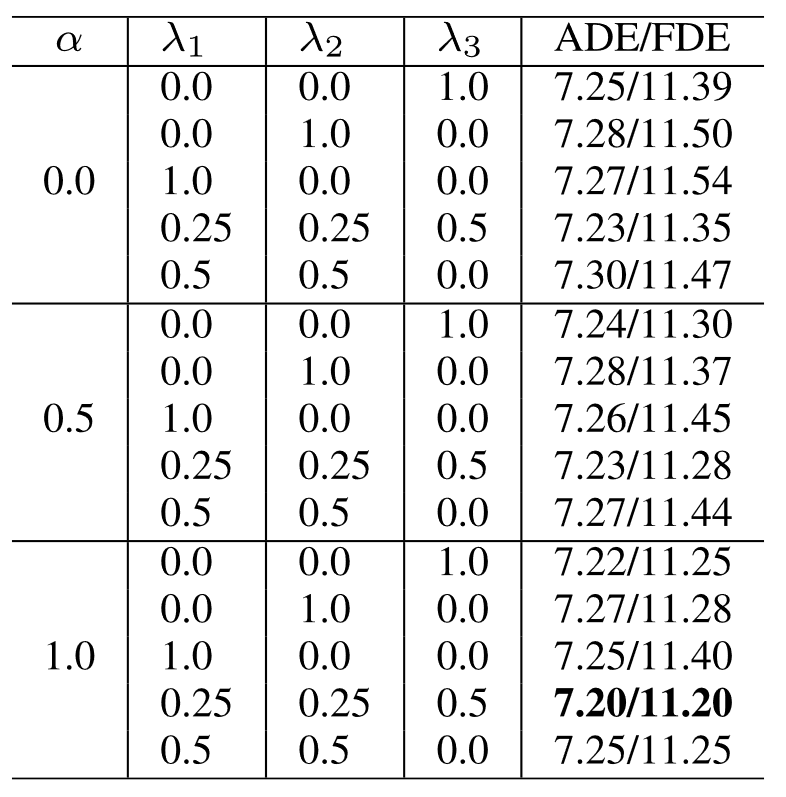
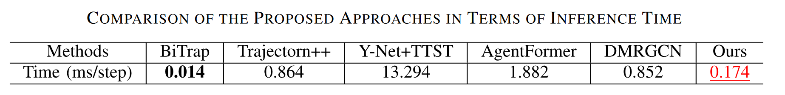

### 要解决问题概述

以往生成多种分布方式：

+ 基于GANs：没有直接在latent space上对数据建模，无法准确完整反映模型特点
+ 基于CVAEs，优化极大似估计：学习的分布可能存在偏移

以上问题导致生成的轨迹存在较大偏移和不准确轨迹

### 轨迹预测困难的原因及面临的问题

一些固有的特点（inherent properties）：

+ 行人意图（intent）和独特的行为模式（behavior patterns），就算有历史轨迹，其未来轨迹也是多种多样的
+ 受周围行人影响，轨迹存在高度社会化（social interactions）的因素，例如：平行行走，成组性组（walking in groups），更换速度/方向来避免碰撞（collision）

GAN的问题：

+ 没有直接在latent space上对数据建模，无法准确完整反映模型特点
+ 由于对抗学习的原因导致训练不稳定

CVAEs和Diffusion的问题：

+ 优化似然性（log-likelihood）的variational lower bound可能存在偏移，造成未来轨迹不准确

为了直接对行人社会关系建模，前人研究存在的问题：

+ 在节点特征上会出现over-smoothing的问题[[2023-09-19.md]][^1]，即随着节点的聚合，会导致节点特征被削弱，造成上文提到的行人多样化的模式被忽视
+ 因此如何在构建社会关系时保持每个行人独特的行为特征是当前社会关系面临的最大问题

### 提出解决思路

对于解决数据分布（Underlying Distribution）建模的问题：

+ propose一种带有模式正则化（pattern normalization）生成流框架（generative flow framework）
+ 通过一系列可逆变换，将复杂的分布转变为简单分布，再获取准确的似然函数进行优化
+ 将复杂的行为分解为一个个可追溯的简单行为特征进行优化

对于解决行人社会关系建模的问题：

+ 提出的dual-graphormer结合了图网络和transformer，其注意力机制可以让模型适应性注意其它节点
+ 不光可以直观高效地对社会关系建模，还可以减轻节点over-smoothing的问题

### 模型

#### STGLow 结构

在训练阶段加入完整轨迹用于反映整个时间段内的行人的行为

#### Temporal Graphormer

将时序特征拆分为行为无关和行为依赖的特征：

+ 时序中行为无关特征揭示历史轨迹对未来轨迹的影响
  + 通过底部Centrality Encoding实现
  + 保证只有之前的特征会对之后产生影响

+ 时序中行为依赖揭示过去各种行为对未来的影响
  + $Q_i、K_i$至Softmax部分实现

#### Spatial Graphormer

只考虑相对位置是不合适的，例如两个人隔着很远相向而行，论文认为需要更多考虑相对方向和行驶方向

+ 将行人相对位置、相对角度和时序Embedding组合相加，相对角度用向量夹角表示$\Delta s_j^t = \frac{\Delta X_i^t \Delta X_j^t}{|\Delta X_i^t| |\Delta X_j^t|}$
+ $\Delta X_i^t$表示某个行人相邻两个时刻间运动向量
+ 由于相对位置没有先后关系，所以没有使用位置编码
+ 相对关系只考虑视角前方180度内的，即$(x_j^t - x_i^t)(x_i^{t} - x_i^{t-1})\ge0$，y同理

#### Glow-PN

文章认为，任何一个复杂的运动行为不是一蹴而就的，而是由许多简单的运动行为组成（如每个时间步上的动作）结合个人的行为习惯（如走路习惯、交通信号、潜在意图 potential intentions），公式表示如下：
$$
MB_{target} \stackrel{f_1}{\leftrightarrow} h_1 \stackrel{f_2}{\leftrightarrow} h_2 ,\dots,\stackrel{f_k}{\leftrightarrow}z
$$

$$
z \sim \mathcal{N}(z;0, I)
$$

这一整个过程最终可以用输入分布的似然函数来表达：
$$
\log p_{\theta}(x) = \log(p_{\theta}(x) | det(dz/dx)) = \log p_{\theta}(z) + \sum_{i=1}^K \log \det(J(f_i^{-1(x)}))
$$
由该公式可以得到需要优化的损失函数：
$$
L_p = \min - \sum_{i=1}^K \log p_{\theta}(x_i)
$$
其中关键的部分是可微可逆的$f$函数如何选择，这里使用了Glow模型[^2]。

其中使用了自己调整的PN替代原来的ActNorm模块，更符合行人轨迹数据集特点。

为了保证可逆性，PN模块为手动设计其正向传播和反向传播的行为。

最后通过两个可逆过程将整个损失函数拆解成正态分布和网络权重的log组合。

#### 解码器设计 Bidirectional Trajectory Prediction

为了避免RNN循环预测带来的累积误差，文章使用并改进了Bitrap模型[^3]

#### 模型总结

上述提到的SG和TG合称dual-graphormer不同于以往的图网络：

+ 该结构结合了self-attention机制的优点避免连接节点的直接聚集，可以极大缓解over-smoothing

### 实验验证

在ETH-UCY、SDD数据集上进行验证

+ 基于 GAN的方法： S-GAN、TPNMS、TPNSTA
+ 基于CVAE的方法：Trajectron++、PECNet、BiTraP
+ 基于Graph的方法：Social-STGCNN、SGCN、DMRGCN、GTPPO
+ 基于Transformer的方法：AgentFormer、STAR
+ 其它方法：Y-Net、CAGN、SIT、MID

##### 定量分析

专门调GAN和CVAE方法拿出来对比说明Glow-PN结构的有效性，与Graph类对比说明dual-graphormer的有效性

##### 定性分析

通过图片可视化来对比BiTraP模型：

+ 首先在不同场景下的预测结果对比，不论是简单场景还是复杂场景，蓝线都要比橙线更靠近真实红线。文章认为这是由于更准确的似然函数表达
  + 第一行分析了简单运行，不论有interactions还是均匀行走（Uniform Walking）
  + 第二、三行展示了更加复杂的动作行为，包括江苏、加速、转弯、防止碰撞和复杂交互（complex interactions），此使文章表示其模型预测结果更加符合行人习惯（more consistent with the laws of human motions），正如前文提到本文模型专门对从简单到复杂的进化过程进行建模
    + 例如BiTraP没有很好把握加减速，以及可能发生的碰撞
  + 此外本文模型通过对xxx建模非常好处理了xxxx，正如xx行xx列所示，还有xxx，类似的有xxxx
+ 生成轨迹分布对比
  + 
  + 解说有点强行

##### 消融实验

都在SDD数据集上进行实验：

+ 模型结构
  + 使用GRU或Transformer来替换对应结构，或者使用一些应用广泛的解码器来替换
+ Dual-Graphormer结构分析
  + 逐渐删掉SG、TG模块的不同结构
+ 针对损失函数中的超参数分析
  + 
  + 其中由于前向后向传播同样重要，文章对$\lambda_1、\lambda_2$采用了同样的超参数
+ 推理时间分析
  + 单位是每一步花费ms
  + 

### 总结与讨论

+ 在预测行人突然急转效果不好
+ 对复杂社会关系建模会增加推理时间，最近已经有文章在讨论改善Transformer的表现了[^4,5]

### 想法

+ 使用Diffusion生成轨迹？

[^1]: Do transformers really perform badly for graph representation?
[^2]: Glow: Generative flow with invertible 1×1 convolutions
[^3]: BiTraP: Bi-directional pedestrian trajectory prediction with multimodal goal estimation
[^4]: Efficient transformers: A survey, 2024
[^5]: Rethinking attention with performers, 2021

