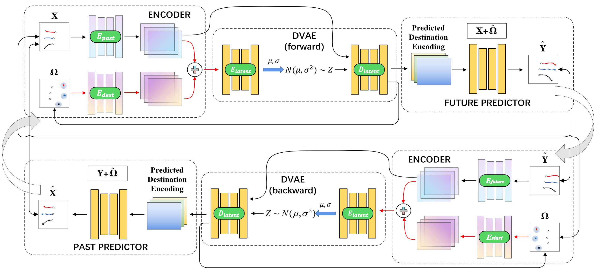
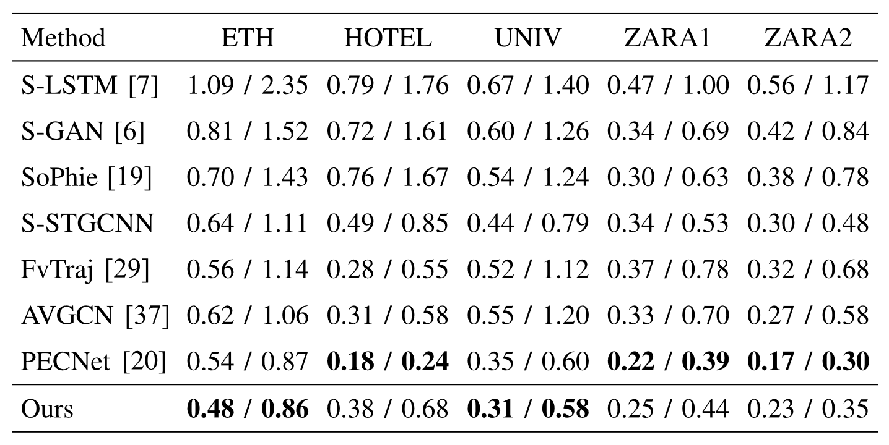
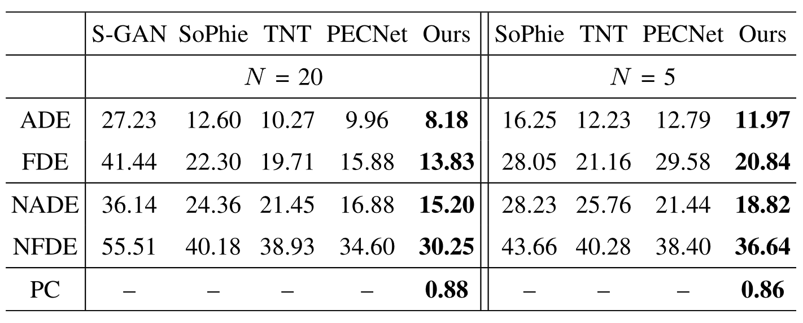

### 轨迹预测的难点和必要性

##### 难点

人类是高度不确定的agent，准确知道行人下一步的位置是非常困难的

##### 必要性

准确预测行人的轨迹对自动驾驶车辆防止碰撞具有最指导性作用

### 轨迹预测困难的原因及面临的问题

要想解决好轨迹预测问题，需要关注：

+ 观察周围的限制
+ 符合社会标准
+ 找到多个可行路径

另外，为了处理行人问题，不光要关注行人过去的轨迹，还需要对行人周围的静态场景语义信息给予更多的关注（例如：人性横道、草坪的范围）。

而社会标准（social criterion）意味着行人会受社会规范（social norms）约束。像是靠右行走（yielding right-of-way）或者是尊重个人空间（respect personal space）。

最近已经有很多工作开始关注对环境语义信息的建模、行人之间的关系、多种可行的受社会规范的轨迹生成。

### 本文解决的问题及思路

从两个方面提升预测精度：

+ 网络结构
+ 行人意图

轨迹预测是个双向过程，通过过去轨迹预测未来轨迹，此外通过未来轨迹反过来推理过去轨迹（轨迹重构）。比如BiTraP就提出双向解码器（bi-directional decoder）来改善长期轨迹预测的精度。

+ 因此本文提出一种双向结构，从过去到未来，和从未来到过去，训练模型在两者之间的映射能力。要实现该网络需要两者满足一种相互约束（reciprocal constraint）。
+ 此外，文章设计了一种模型来专注于一些场景中潜在的目标点。因为目标点可以辅助生成一种对行人异物更具有指向性的表达（distinctive representation to simulate the agent's intention），即基于目标的CVAE（DVAE）
+ 基于相关系数的研究，本文提出了一种预测致信的指标（Predictive Confidence），在离线场景下可以在不知道真实路径时指出预测轨迹的可信（reliable）程度有多高

### 前人研究

##### 行人轨迹预测

Social-LSTM:

+ 使用RNN
+ 在一定范围内通过pool latent来计算行人间相互作用

Social-GAN:

+ 使用GAN
+ 提出基于相对距离的方式计算行人关系

##### 轨迹生成

+ SoPhie
  + 可以同时获取轨迹记录和场景语义信息生成多轨迹

+ Endpoint CVAE[^1]
  + 模拟行人轨迹规划和社会pooling

##### Cycle Consistency Learning

和我的计划类似，都用了其它领域的内容

结构：介绍该领域关键性文章，然后受其中一篇启发（Inspired By xxx）

##### Similarity Measures

对轨迹数据的挖掘分析[^2][^3]

结构：罗列关键文章，表命他们都存在xxx问题，然后一段介绍自己的改进

### 模型结构

##### 模型总览

为了保证前向预测和反向预测的有效性，需要进行约束：
$$
X \approx P_{\theta}(\hat{Y}) \approx P_{\theta}(F_{\gamma}(X))
$$

$$
\hat{Y} \approx P_{\gamma}(\hat{X}) \approx P_{\gamma}(F_{\theta}(\hat{Y}))
$$

即$P_{\gamma}F_{\theta}$需要互相可逆。

该模型参考了早期的Social-LSTM来构建

##### DVAE（Destination VAE）

目标点可以极大影响轨迹的方向

##### 预测置信

由于未来轨迹的不可知，人们会对预测网络的准确度产生怀疑。前人的工作方法都是基于先验概率。本文首次提出可预测置信的概念。

主要思路是由于本文结构是高度可逆的，那么如果一个预测的轨迹是可信的，那么反过来推理的历史轨迹应该是与真实历史轨迹相似的。主要是计算预测未来轨迹的误差和推理过去轨迹的误差两者间的皮尔逊相关系数，公式如下：
$$
\mathcal{PC}_{\hat{Y}^i} = \rho(\parallel \hat{Y} - Y \parallel_2, \parallel \hat{X} - X \parallel_2)
$$

##### 损失函数

损失函数由前向训练、反向训练、KL散度三部分组成：
$$
W_{+}[\gamma] = \lambda_1 \cdot \parallel Y - F_{\gamma}(X) \parallel_2 + (1 - \lambda_1) \cdot \parallel X - P_{\theta}(F_{\gamma}(X)) \parallel_2
$$

$$
W_{-}[\theta] = \lambda_2 \cdot \parallel X - P_{\theta}(Y) \parallel_2 + (1 - \lambda_2) \cdot \parallel Y - F_{\gamma}(P_{\theta}(Y)) \parallel_2
$$

$$
\mathcal{L}_{total} = W_+[\gamma] + W_-[\theta] + D_{KL}(\mathcal{N}(\mu,\sigma) \parallel \mathcal{N}(0,I))
$$

其中KL散度用于保证训练的DVAE采样器分布与目标分布相同

### 实验验证

##### 验证指标

+ ADE

+ FDE

+ 参考文章[^4]提出NADE和NFDE，即正则化的ADE和FDE，避免轨迹本身的属性对判断标准产生影响：
  $$
  NADE = M_{\tau}[ADE(\tau) \cdot NW(\tau)]
  $$

  $$
  NFDE = M_{\tau}[FDE(\tau) \cdot NW(\tau)]
  $$

  $$
  M_{\tau} = \sqrt{\frac{K_p}{p(\tau)}} = \sqrt{\frac{K_l \cdot K_v}{l(\tau) \cdot v(\tau)}}
  $$

  这里的$\tau$指代轨迹

##### 对比实验

在ETH-UCY上

结果不算很好

SDD数据集上

本文表现出了非常不错的性能。

##### 不同采样数量N实验

验证多目标采样的能力。随着采样数量的上升，模型的准确度也在提升，这说明了行人目标可以提供非常多有用的信息来辅助轨迹预测。

##### 消融实验

分别移除RC和DVAE环节进行验证

### 想法

这篇文章废话太多，用语不客观，用图异常

前向预测和反向预测在同一个网络里面进行好吗？

[^1]: It is not the journey but the destination: End-point conditioned trajectory prediction
[^2]: Trajectory data mining: An overview
[^3]: Mining regular behaviors based on multidimensional trajectories
[^4]:Human trajectory prediction and generation using LSTM models and GANs
