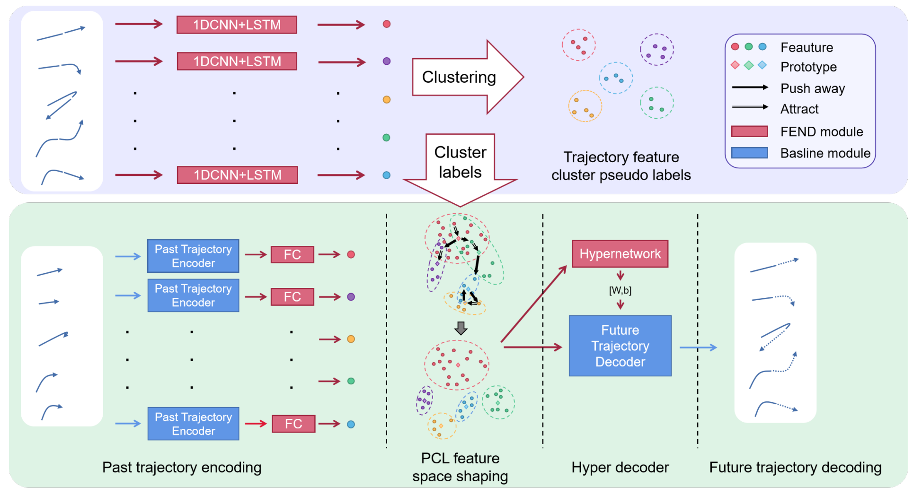
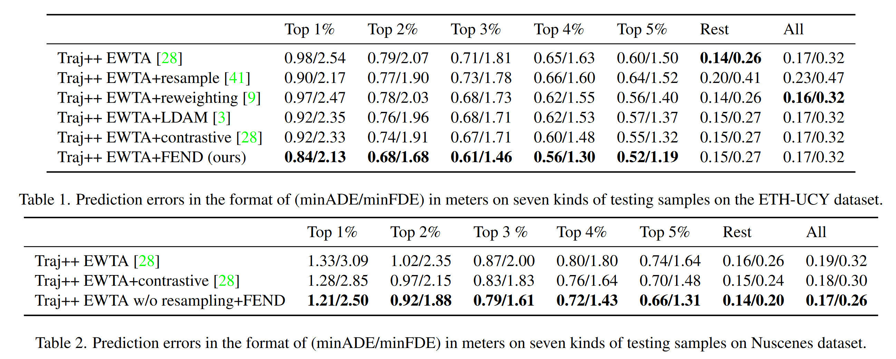
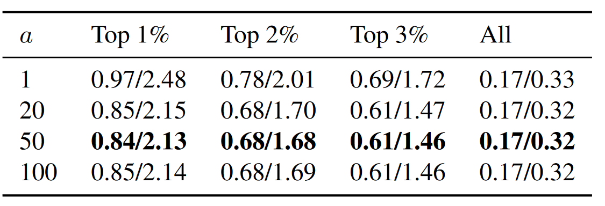
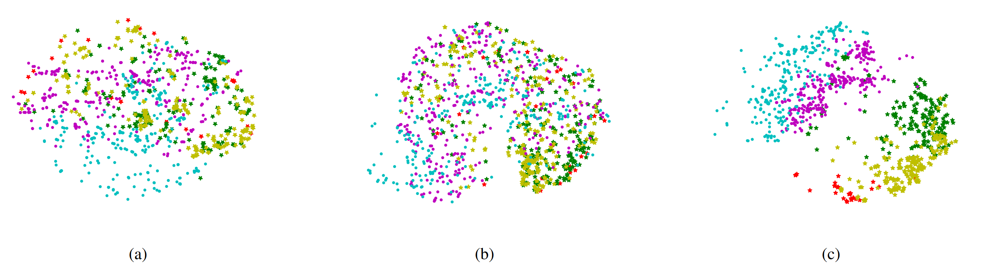
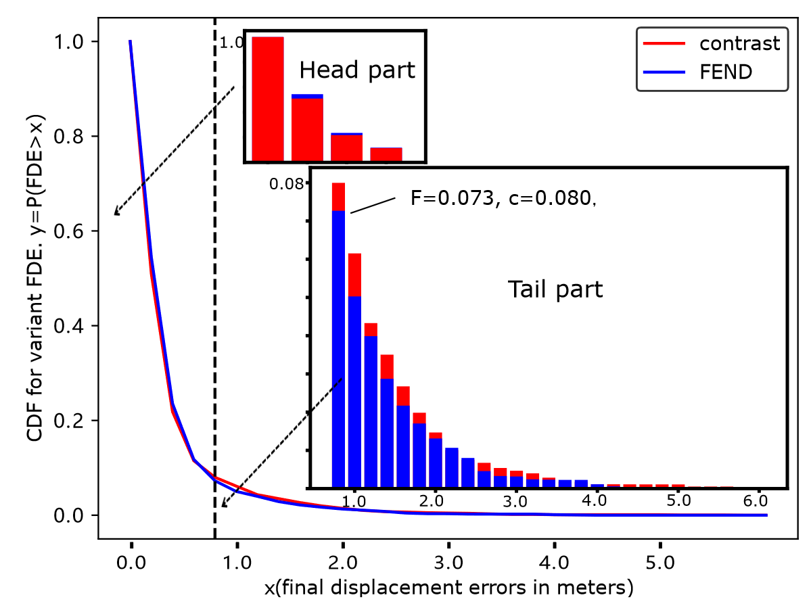

### 轨迹预测的难点和必要性

+ 一个棘手的问题（a gordian technique）
+ 数据不平衡、长尾数据使之更复杂和安全关系重大（safety-critical）
+ 大多数轨迹遵循简单的运动轨迹（kinematic rules），而偏离（deviating）和防止碰撞的场景是稀少的。这使得通常的样本预测简单，而长尾样本预测困难，进而使得相关安全问题更加突出

### 轨迹预测前人研究问题

+ 大多数模型在训练和验证阶段平等对待所有样本
+ 没有考虑尾部数据运动模式（motion pattern）的多样性

### 前人研究

##### 基于聚类的轨迹预测方法[^1][^2][^3]

这些方法目的是从中选出未来的轨迹模式并生成更多不同的轨迹。这与本文从常见数据中分离识别处长jl尾数据的目的并不相同（different from our goal to xxx）。

##### 长尾数据处理

主要分为数据重采样和损失重分配（像集成学习？）

使用了hypernetwork作为轨迹解码器利用它的分布感知建模能力来处理长尾数据，据我们所知（to our best knowadge）关内容尚未在长尾回归问题中被讨论

### 提出解决思路

将完整轨迹提取特征聚类，以此将常规数据和长尾数据分离，形成聚类标签；然后用历史数据编码成特征，根据据类标签将特征分辨为是否是长尾数据。

### 模型

会首先在离线状态下将轨迹进行正则化处理，使得模型能更加专注于运动模式学习

##### 分布感知预测器

由于需要分别训练不同的解码器会导致训练量过大，且样本不足也会带来过拟合问题。因此本文选用了HyperNetworks[^4]来作为解码器，它们是同一个网络下的不同解码器。但包含了所有的样本信息。

##### 损失权重分配

$$
\mathcal{L} = \mathcal{L}_{pred} + \lambda \mathcal{L}_{ProtoNCE}
$$

第一项是原始网络的损失，第二项是附加网络的损失。对于预测结果已经很好的网络，PCL不需要做太多修改，这里的系数$\lambda$就用于让它关闭。本文会首先预热网络得到$\mathcal{L'}_{pred}$，之后再决$\lambda$。

### 实验验证

##### 划分长尾数据

根据FDE指标来划分

##### 对比实验

选取几种不同的长尾数据处理方法与本文方法进行对比。

##### 参数灵敏度实验（Parameter sensitivity study）

参数值取1、20、50、100

##### T-SNE对比

最右侧的点是简单样本，星形是长尾样本，可以看到本文模型可以很好将两类样本分离。

##### 累积分布函数可视化

可以看到在各个FDE水平上，本文模型的预测结果都要优于对标模型

##### 本文限制

正常样本的表现不佳

有很多其它指标可以用，如NLL（Negative Log-Likelihood）[^5][^6][^7],还有哪些考虑场景顺应性和社会可接受性的预测[^8][^9]。

本文认为未来加入社会关系会是聚类学习的一个重要方向。

### 总结与讨论

[^1]:Multipath: Multiple probabilistic anchor trajectory hypotheses for behavior prediction.
[^2]:Three steps to multimodal trajectory prediction: Modality clustering, classification and synthesis.
[^3]:Remember intentions: Retrospective-memory-based trajectory prediction.
[^4]: Hypernetworks.
[^5]: Accurate and diverse sampling of sequences based on a “best of many” sample objective.
[^6]: Introducing probabilistic b ́ ezier curves for n-step sequence prediction.
[^7]: The trajectron: Probabilistic multi-agent trajectory modeling with dynamic spatiotemporal graphs
[^8]:Injecting planningawareness into prediction and detection evaluation.
[^9]:Human trajectory forecasting in crowds: A deep learning perspective.