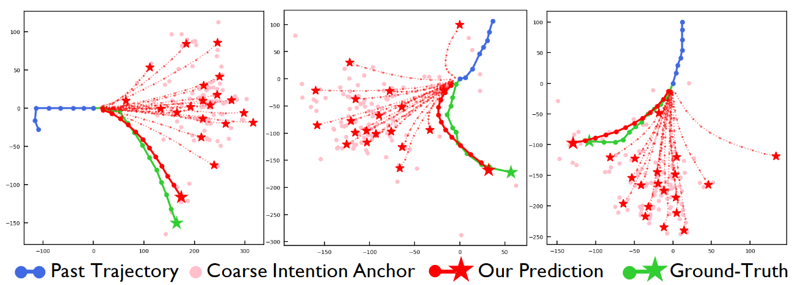

### 轨迹预测的难点和必要性

轨迹预测已在多个领域得到广泛应用

+ 自动驾驶
+ 无人机
+ 监控系统
+ 交互式机器人

另外也是一个基本的将过去与未来连接的科学问题。

### 轨迹预测前人研究问题

大多数使用基于参数的模型都是使用许多训练样本来进行训练得到的统一参数，这会导致推理时大量不相干的样本干扰当前模型的表达。（同时影响行为多样性的表达，这与行人运动的特点是相悖的）。

而基于参数的模型并不是最优的：

+ 缺乏解释性，其模型参数在物理世界没有明确的语义含义。这在安全敏感应用中是非常重要的问题
+ 大量无关的数据会参与预测当前的状况，干扰性能表现

### 提出解决思路

基于神经心理学中人类未来的行为会通过对过去学习的信息进行回忆来产生。MemoNet则是通过搜索与当前情况相似的场景来预测未来。

模型分为两部分，第一部分利用MemoNet来预测intension（intension包含了绝大多数模式信息modality information），第二部分则是补全剩余的轨迹。

在行人轨迹预测领域，[^1]最早提出使用记忆网络。但存在如下问题：

+ 前人只考虑的单人轨迹预测，本文可以处理多个体轨迹预测；
+ 前人存储完整的轨迹，本文只关注intention，更加高效
+ 前人使用修正cosine相似度来搜索，本文使用可训练addressor来搜索相似patterns
+ 前人很难保证轨迹差异性和准确度，本文使用intention聚类来实现多模态鲁棒的预测轨迹

### 模型

#### 1. MemoNet: 意图预测

##### 1.1 Joint-reconstruction-based architectures

该结构用于训练编解码器，之后使之用于轨迹特征的提取，提取的特征是适宜的（compatible），损失函数如下：
$$
\mathcal{L}_{rec} = \parallel \hat{X} - X \parallel^2_2 + \alpha \parallel \hat{y}^{T_f} - y^{T_f} \parallel^2_2
$$
然后就可以构建初始化的Memory Bank了：

##### 1.2 过滤器

基本思想是使用起始点和终点来去掉相似的轨迹。

对比前人工作：

+ 不受排序影响
+ 无需训练

此外，与字典类型的存储方式对比：

+ 字典通常需要预先设置好的大小
+ 字典通常需要加权求和数个实例，本文的存储方式可以直接通过单个的实例获取目标，这在训练数据和推理数据之间建立了直接的联系

##### 1.3 存储寻址器（Memory addresser）

由于之前的cosine 距离无法完全反映两个样本之间的距离，所以本文提出了可训练的距离衡量模型：
$$
s_i = \mathcal{F}_{ATT}(q,k_i) = \frac{\mathcal{F}_q(q) \mathcal{F}_k^T(k_i)}{\parallel \mathcal{F}_q(q) \parallel_2 \parallel \mathcal{F}_k^T(k_i) \parallel_2}, i = 1,2,\cdots,M
$$
这里的两个$\mathcal{F}$是MLPs，用于将特征映射到适合比较的特征空间，再求取他们之间的cosine距离。

而为了训练这一结构，最关键的是如何决定真实的距离作为优化目标。本文认为，特征空间的距离需要可以反映真实物理空间的预测误差。于是本文使用基于pseudo label的损失函数来表达：
$$
\mathcal{L}_{Addr} = \sum^M_{i=1} (s_i - max(0, \frac{d_T - d_i}{d_T}))^2
$$
其中$max(0, \frac{d_T - d_i}{d_T})$就是pseudo label，$d_i = \parallel y^{T_f} - \hat{y}_i^{T_f} \parallel_2$，$d_T$则是阈值。用于缩放和平移。相当于是尽可能使得两者的相对距离的差异最小。

##### 1.4 意图多样性

意图可以帮助唤醒相关记忆，但该记忆会使得人物笔直像目标行进，而忽略了其它可能的动作，如急转弯和急停。虽然通过增大样本量可以达到类似效果，但会增加搜索时间，于是本文提出基于intention聚类的方法。首先先找到大量得分高的记忆样本，然后使用聚类获得指定数量的目标，这样可以获得更加多样性的目标轨迹，同时也可以整合数个轨迹的特点。

#### 2. 完整模型

### 实验分析

#### 定性分析

##### 预测意图可视化

##### 预测轨迹可视化

本文模型对急转弯等具有挑战性的模型表现出了较好的预测效果（差异大的case）

##### 提取样本与预测样本关联可视化

左侧是现在需要预测的轨迹，右侧是相似的历史轨迹，可以看出两者之间的明显联系。

#### 消融实验

##### 各模块功能

##### 不同实例采集数量影响

##### 不同滤波阈值对比

与之前的消融实验对比，该滤波实际功能并不大，而且如果参数取得不好，会进一步起到反效果。

### 总结与讨论

+ 虽然本文提到memory-bank的方法可以保证独立性，但同时也带来另一个问题——扼杀了模型的整合表达推理能力（多个轨迹联合推理）。
+ 没有考虑不同场景下的未来intention的差异
+ 对于测试集未见过的样本无法处理
+ 聚类方法产生多样性，其多目标推理过程合理吗？
+ **获得的memory bank在训练完成后就无法更新了（因为filter也是通过已有memory bank训练得到的）**
+ 基于起始和终止点进行匹配，无法准确反映轨迹的社会特征和行人的运动特征
+ 一次预测一个人的轨迹

存在问题：
+ （当前匹配效率低？）推理速度太慢
+ 生成的意图点没有考虑环境是否可行
+ 聚类生成的点依靠广泛分布，缺乏明确目标
+ 对于未来发生在动态轨迹上的信息无法准确预测

[^1]:Mantra: Memory augmented networks for multiple trajectory prediction.

