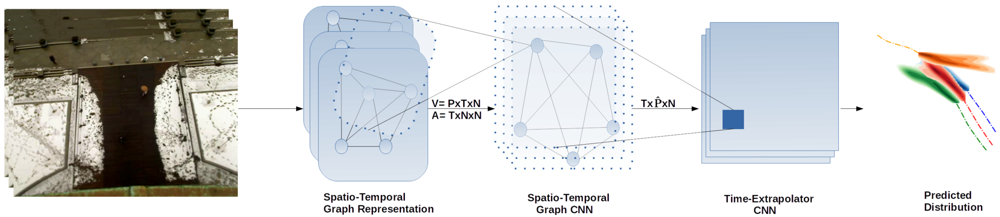
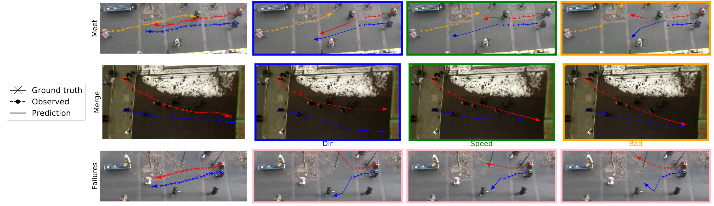
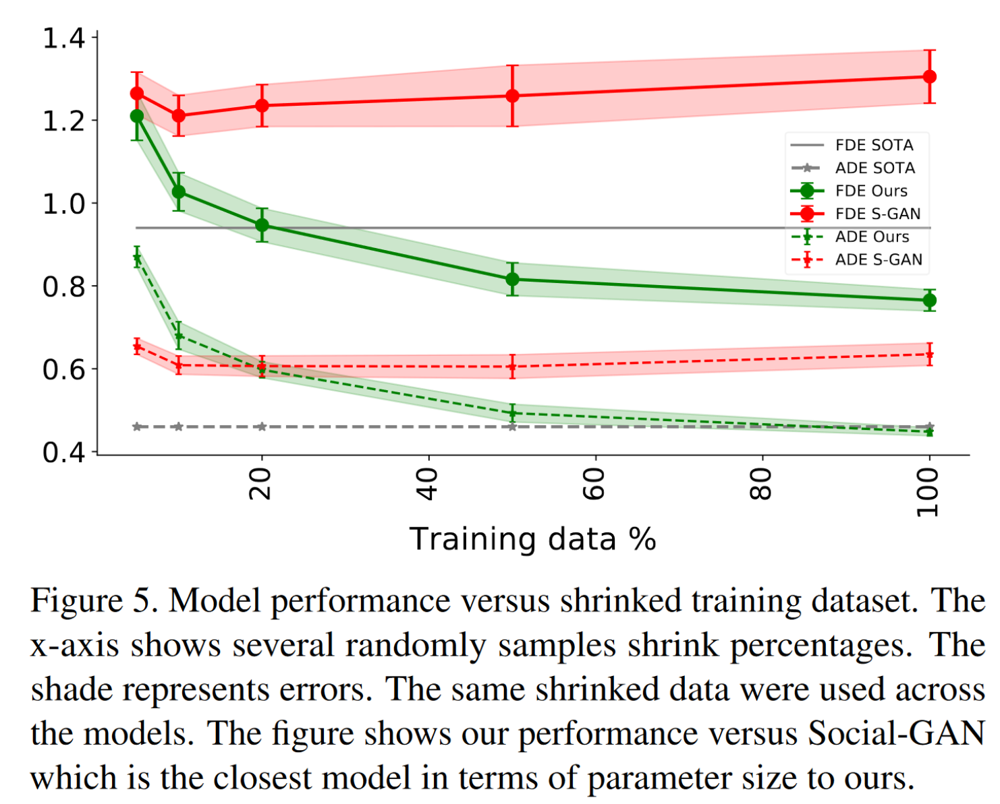

### 轨迹预测的难点和必要性

社会关系必要性：

+ 70%的行人会成群行走

难点：

+ 复杂社会环境，如平行行走、在群体里行走、防止碰撞和从不同方向汇聚向一个特定目标
+ 行动的随机性，使得行人目标和意向路径未知
### 轨迹预测前人研究问题

前人主要以使用聚合方法为主，很多使用深度循环网络，本文认为该方案在参数层面是低效的，并且在训练上花费高昂。

使用RNN的中间隐藏层输出作为聚合层的输入，这存在如下问题：

+ 这是反直觉的，可解释性弱
+ 这些机制常基于启发式方法，通常不适合用于行人关系建模。

这其中social-BiGAT就是基于图网络的，因为图网络的拓扑结构是社会关系一种更自然的表现方法。这是一种更直接、直觉的、高效的方法。但同时social-BiGAT没有完全利用图网络的表达能力，而是仅仅作为pooling机制的一个基本单元。本文结构则通过场景时空图建模从中获取到了更多的好处。

### 提出解决思路

+ 提出时空图来替换原有的聚合层
+ 使用CNN来代替循环网络

### 模型

##### 图模型表达

图$G(V_t, E_t)$中，V表示顶点，E表示边$E_t = \{e_t^{ij} | \forall i \in\{1, \cdots,N\} \}, e_t^{ij}=1,if\ i\ and\ j\ connected$。另外为了表示节点之间的相关性强弱，文中提出了邻接矩阵$A_t$，本文使用的计算邻接矩阵的公式如下：
$$
a_{sim,t}^{ij}=
\left\{\begin{array}{l}
\frac{1}{\Vert v_t^i - v^j_t \Vert_2}\ &,\Vert v_t^i - v^j_t \Vert_2\neq0 \\
0\ &,Otherwise
\end{array}\right.
$$

##### 邻接矩阵初始化

本文使用对接节点度矩阵$\Lambda_t$辅助初始化:
$$
A_t = \Lambda_t^{-\frac{1}{2}} (A_t + I) \Lambda_t^{-\frac{1}{2}}
$$

### 实验验证

### 总结与讨论